<picture>
  <source media="(prefers-color-scheme: dark)" srcset="./assets/hero-dark.svg">
  <source media="(prefers-color-scheme: light)" srcset="./assets/hero-light.svg">
  
</picture>

 

I've spent the last four years shipping production software across the whole stack: Next.js frontends, React Native apps, Node.js and NestJS services, and the AWS infrastructure they run on. I like owning a feature from the first schema sketch to the dashboard that tells me it's healthy in production.

The trace above is how I think about work. Every product is a request moving through layers, and each layer has a budget. My job is to make each one fast, correct, and easy for the next engineer to change.

 

### What I work on

| | |
|:--|:--|
| **Frontend** | Next.js App Router, React Server Components, TypeScript. Rendering strategy (SSR, ISR, PPR), Core Web Vitals, design systems in Tailwind. |
| **Mobile** | React Native and Expo apps that share types, API clients and business logic with the web codebase. |
| **Backend** | NestJS and Node.js services, REST and GraphQL APIs, auth and RBAC, payments and webhooks, background jobs. |
| **Data** | PostgreSQL and MongoDB schema design, indexing and query tuning, Redis caching, Prisma. |
| **Cloud** | AWS: Lambda, ECS, S3, CloudFront, RDS, SQS, Cognito, CloudWatch. Docker and GitHub Actions for delivery. |
| **System design** | Caching layers, async and event-driven flows, horizontal scaling, and the logs, metrics and alerts that make it all observable. |

 

### Building with AI

I treat LLMs as another service in the trace, with a latency budget, a cost, and a failure mode.

- **Product features:** streaming chat and summaries, tool calling, and structured output wired into real user flows.
- **Retrieval:** embeddings and vector search over product data, so answers come from the user's own records.
- **Production concerns:** timeouts, fallbacks, caching, rate limits and cost tracking, so an AI feature degrades gracefully instead of breaking the page.
- **Daily workflow:** AI coding tools for faster iteration, with the same code review and tests as anything else I ship.

 

### Selected work

| Project | What it is |
|:--|:--|
| [**portfolio**](https://github.com/sherryy67/portfolio) | My portfolio and case studies, built with Next.js and TypeScript. Live at [dev-sher-ali.vercel.app](https://dev-sher-ali.vercel.app). |
| [**taskly**](https://github.com/sherryy67/taskly) | A task management app. |
| [**auto-azure-mobile**](https://github.com/sherryy67/auto-azure-mobile) | A cross-platform mobile app built with React Native. |
| [**react-native-boiler-plate**](https://github.com/sherryy67/react-native-boiler-plate) | The starter I use for new React Native projects, with navigation, state and an API layer already set up. |

Longer case studies, including large Next.js platforms and payment-enabled products, are on [my portfolio](https://dev-sher-ali.vercel.app).

 

### Get in touch

I'm open to full-stack and product engineering roles, and to conversations about system design or AI features that need to hold up in production.

Email [dev.sherali07@gmail.com](mailto:dev.sherali07@gmail.com) or visit [dev-sher-ali.vercel.app](https://dev-sher-ali.vercel.app).
