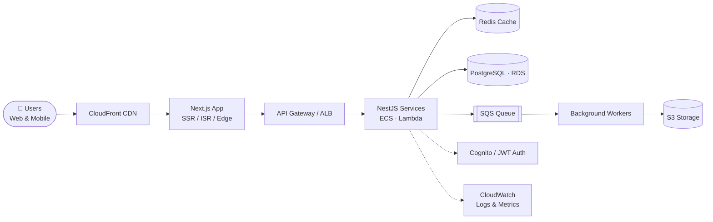
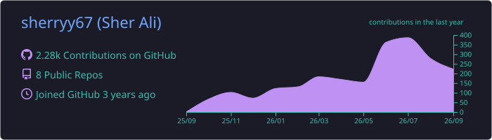
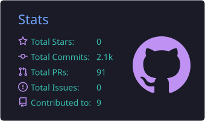
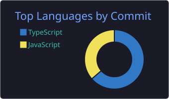
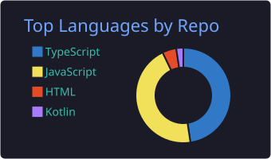
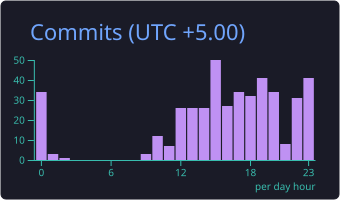

<!-- ═══════════════════════════ HEADER ═══════════════════════════ -->
<div align="center">


<a href="https://dev-sher-ali.vercel.app">
  
</a>

<br/>

<a href="https://dev-sher-ali.vercel.app"></a>
<a href="mailto:dev.sherali07@gmail.com"></a>


</div>

---

## 👨‍💻 About Me

I'm a **Senior Full-Stack Engineer** with **4+ years** of production experience designing, building, and shipping web and mobile products end to end — from database schema and API design to cloud infrastructure and pixel-perfect UI.

I care about the whole system, not just one layer of it: how the frontend renders, how the API scales, how data flows, and how it all runs reliably on **AWS**. I work closely with product, design, and engineering teams in Agile environments, and I enjoy owning features from the whiteboard to production monitoring.

```ts
const sherAli = {
  role:        "Senior Full-Stack Engineer",
  experience:  "4+ years in production",
  frontend:    ["Next.js", "React", "React Native", "TypeScript"],
  backend:     ["Node.js", "NestJS", "Express", "REST", "GraphQL"],
  data:        ["PostgreSQL", "MongoDB", "Redis", "Prisma"],
  cloud:       ["AWS", "Docker", "CI/CD", "Vercel"],
  focus:       ["System Design", "Performance", "Scalability", "Clean Architecture"],
  mindset:     "Ship fast, measure, then make it better.",
};
```

---

## 🧠 Core Expertise

<table>
<tr>
<td width="50%" valign="top">

### 🎨 Frontend & Mobile
- **Next.js (App Router)**, React, TypeScript
- Server & Client Components, Middleware
- SSR · SSG · ISR · PPR, edge & CDN caching
- **React Native / Expo** for cross-platform apps
- Redux, Zustand, Context, React Query
- Tailwind CSS, SCSS, design systems

</td>
<td width="50%" valign="top">

### ⚙️ Backend & APIs
- **Node.js, NestJS, Express**
- REST & GraphQL API design
- Auth: JWT, OAuth2, RBAC, session management
- Payments, webhooks, background jobs & queues
- Microservices & modular monolith patterns
- Validation, error handling, API versioning

</td>
</tr>
<tr>
<td width="50%" valign="top">

### ☁️ Cloud & DevOps (AWS)
- **Compute:** EC2, Lambda, ECS / Fargate
- **Storage & CDN:** S3, CloudFront
- **Data:** RDS, DynamoDB, ElastiCache
- **Integration:** API Gateway, SQS, SNS
- **Security & Ops:** IAM, Cognito, CloudWatch
- Docker, GitHub Actions CI/CD, Nginx

</td>
<td width="50%" valign="top">

### 🏛️ System Design & Architecture
- Scalable, fault-tolerant service design
- Caching strategies (CDN, Redis, app-level)
- Database modeling, indexing & query tuning
- Event-driven & async processing
- Load balancing & horizontal scaling
- Observability: logging, metrics, alerting

</td>
</tr>
</table>

---

## 🛠️ Tech Stack

<div align="center">

**Languages & Frontend**


**Backend & Databases**


**Cloud, DevOps & Tooling**


</div>

---

## 🏗️ How I Architect Systems

A typical production setup I design and build — optimized for performance, security, and horizontal scale:



**Principles I build by**

| | |
|---|---|
| ⚡ **Performance first** | Cache at every layer, render at the right layer, measure with real metrics |
| 📈 **Designed to scale** | Stateless services, async workloads, and databases modeled for growth |
| 🔐 **Secure by default** | Least-privilege IAM, validated inputs, hardened auth flows |
| 🧩 **Maintainable** | Clear module boundaries, typed contracts, and code that's easy to review |
| 🔭 **Observable** | If it runs in production, it has logs, metrics, and alerts |

---

## 🚀 What I Do

- **Own features end to end** — database, API, frontend, deployment, and monitoring
- **Design system architecture** for new products and refactor existing ones for scale
- **Build and deploy on AWS** with containerized services, serverless functions, and CI/CD pipelines
- **Ship cross-platform apps** with a shared TypeScript codebase across web and mobile
- **Optimize performance & SEO** — Core Web Vitals, rendering strategy, and caching
- **Lead through code review & mentoring**, setting standards teams can actually follow
- **Translate business requirements** into clean, reliable technical solutions within Agile/Scrum teams

---

## 💼 Selected Work

Featured projects and case studies live on my portfolio:

<div align="center">

<a href="https://dev-sher-ali.vercel.app"></a>

</div>

<br/>

| Area | Highlights |
|---|---|
| 🌐 **Large-scale web platforms** | Next.js App Router with Server Components, ISR/PPR, and CDN caching |
| 🔌 **Scalable backends** | NestJS/Node.js APIs with authentication, RBAC, payments, and webhooks |
| ☁️ **Cloud infrastructure** | AWS deployments using containers, serverless, queues, and managed databases |
| 📱 **Cross-platform apps** | Web and mobile products sharing logic, types, and design systems |

---

## 📊 GitHub Stats

<div align="center">










</div>

---

## 🤝 Let's Connect

I'm always open to discussing **full-stack roles, system design challenges, cloud architecture, or interesting product ideas**.

<div align="center">

<a href="mailto:dev.sherali07@gmail.com"></a>
<a href="https://dev-sher-ali.vercel.app"></a>

<br/><br/>

*Thanks for stopping by — feel free to explore my repositories and ⭐ anything you find useful.*


</div>
